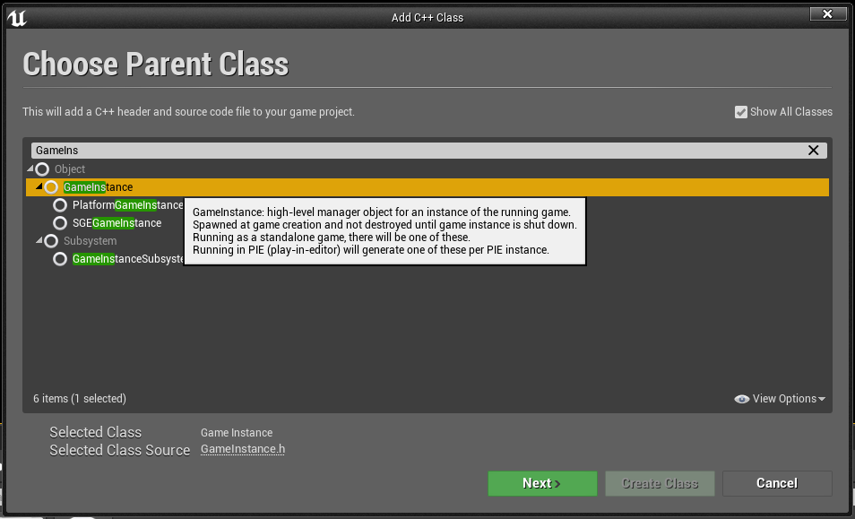
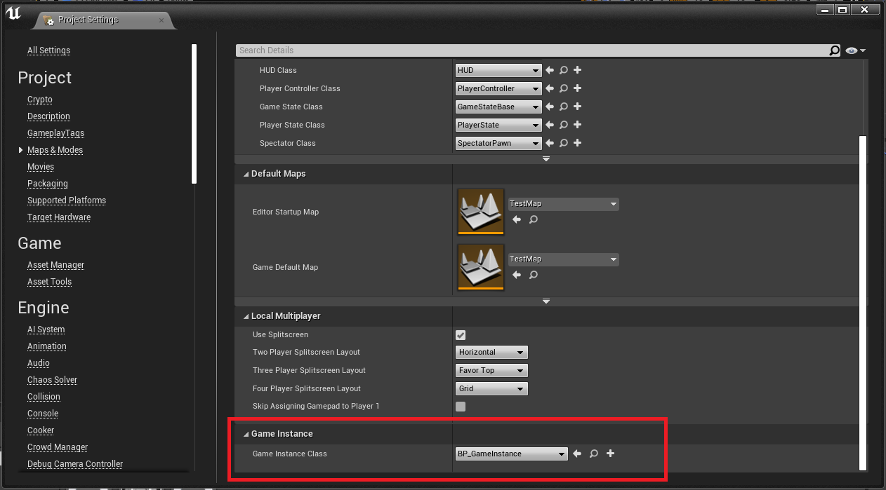
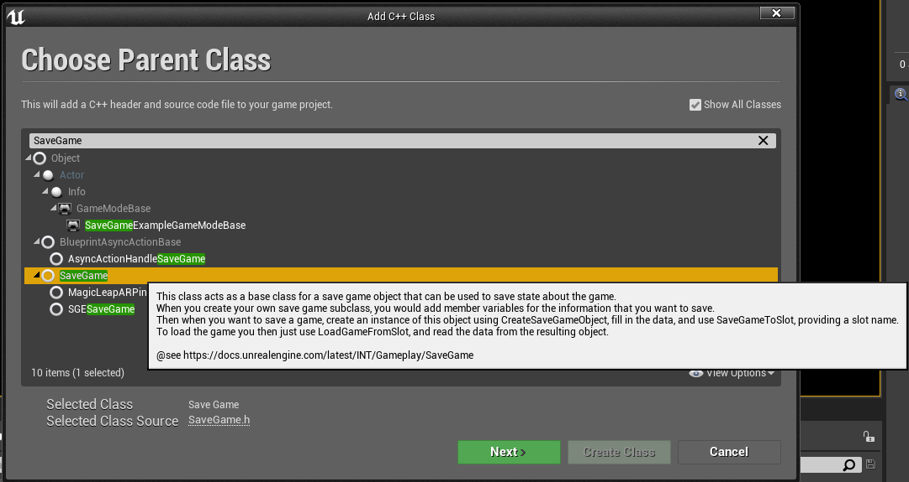

# Save Game in Unreal Engine 4 with C++

I'm learning UE4 and this is a **superficial explanation** of how to save your game data using the SaveGame class in Unreal Engine 4.
You can download this project and explore how integrate your saved data in your game.

##### Summary:
- Create a new class that inherits from GameInstance class;
    - You can access GameInstance from anywhere. GameInstance starts when your game starts and die when your game die.
- Create a new class that inherits from SaveGame class;
    - SaveGame class will contain all data (properties) to save.
- Make a reference to your SaveGame class in GameInstance class;
    - You will be able to get your saved data from anywhere.
- Implement LoadGame and SaveGame methods in GameInstance class.
    - You will be able to load and save your game from anywhere.

------------

1. Create a new C++ Game Instance class for your project:
    * Select "Show All Classes";
    * Search for GameInstance and then select it:

    

    * You can create a Blueprint that inherits your new Game Instance class.
    * In Project Settings window, on Maps & Modes, select your Game Instance class or a Blueprint that inherits from your Game Instance:
    
    

2. Create a new C++ Save Game class:
    * Select "Show All Classes";
    * Search for SaveGame and then select it:

    

3. In your Save Game header file (.h) add a constructor and some properties to save:
    
   ```c++
   USGESaveGame();
   	
   UPROPERTY(BlueprintReadWrite, Category="Player Info")
   FString PlayerName;
   
   UPROPERTY(BlueprintReadWrite, Category="Player Info")
   int32 PlayerAge;
   
   UPROPERTY(BlueprintReadWrite, Category="Player Info")
   EPlayerStatus PlayerStatus; 
   ```
   
   In this case we will save a string, an integer and an simple enumeration. You can check this file [here](Source/SaveGameExample/Public/SGESaveGame.h).

4. Create a reference to your Save Game class (in this case is ```USGESaveGame* SaveGameObject```) Load and Save methods in your Game Instance header file (.h):
    
    ```c++
   // Optional this will be the save file name. Initialization is in constructor.
   UPROPERTY(BlueprintReadOnly)
   FString SaveGameSlotName;
   	
   UPROPERTY(BlueprintReadWrite, Category = "Settings")
   USGESaveGame* SaveGameObject;
   
   UFUNCTION(BlueprintCallable, Category = "Game Manager")
   void LoadGame();
   
   UFUNCTION(BlueprintCallable, Category = "Game Manager")
   void SaveGame(); 
   ```
   You can check this file [here](Source/SaveGameExample/Public/SGEGameInstance.h).
   
5. Implement those methods in your Game Instance .cpp file:
    * LoadGame method:
        ```c++
        void USGEGameInstance::LoadGame()
        {
            // Try to load a saved game file (with name: <SaveGameSlotName>.sav) if exists
            USaveGame* LoadedGame = UGameplayStatics::LoadGameFromSlot(SaveGameSlotName, 0);
            SaveGameObject = Cast<USGESaveGame>(LoadedGame);
        
            GEngine->AddOnScreenDebugMessage(-1, 15.0f, FColor::Yellow, TEXT("Trying to load a saved game."));
            
            // If file does not exist try create a new one
            if (!SaveGameObject)
            {
                GEngine->AddOnScreenDebugMessage(-1, 15.0f, FColor::Yellow, TEXT("No saved games found. Trying to save a new one."));
                
                SaveGameObject = NewObject<USGESaveGame>();
      
                // Call SaveGameToSlot to serialize and save our SaveGameObject with name: <SaveGameSlotName>.sav
                const bool IsSaved = UGameplayStatics::SaveGameToSlot(SaveGameObject, SaveGameSlotName, 0);
        
                LogIfGameWasSavedOrNot(IsSaved);
            }
            else
            {
                GEngine->AddOnScreenDebugMessage(-1, 15.0f, FColor::Yellow, TEXT("Saved game found. Loaded."));
            }
            
        }
        ```
    * SaveGame method:
        ```c++
        void USGEGameInstance::SaveGame()
        {
            GEngine->AddOnScreenDebugMessage(-1, 15.0f, FColor::Yellow, TEXT("Saving game..."));
            
            // Call SaveGameToSlot to serialize and save our SaveGameObject with name: <SaveGameSlotName>.sav
            const bool IsSaved = UGameplayStatics::SaveGameToSlot(SaveGameObject, SaveGameSlotName, 0);
        
            LogIfGameWasSavedOrNot(IsSaved);
            
        }
        ```
      
      Those implementations can be found [here](Source/SaveGameExample/Private/SGEGameInstance.cpp).